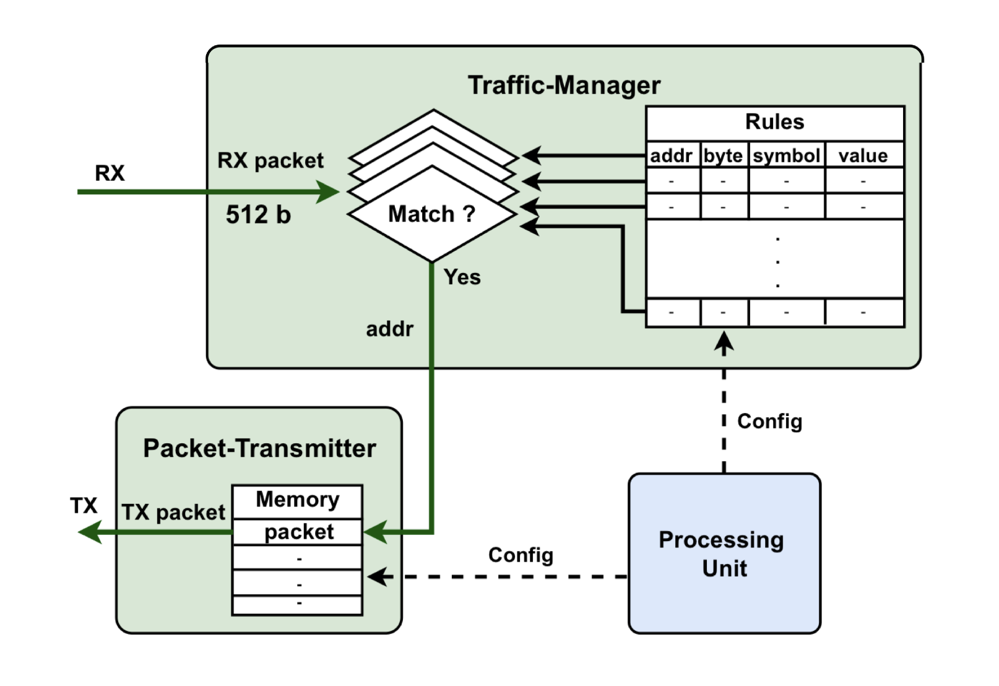
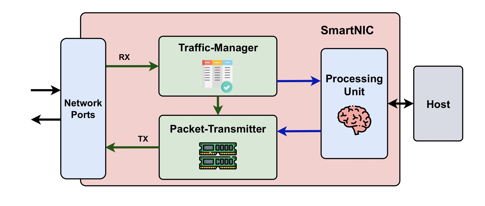
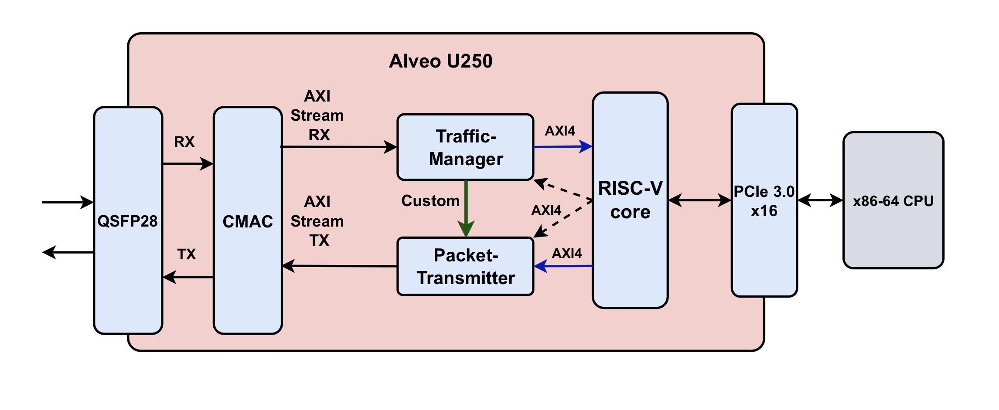
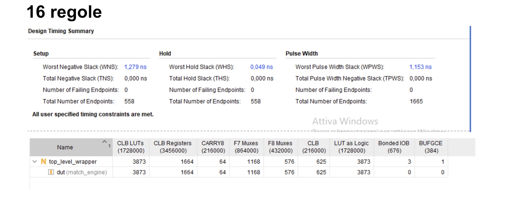
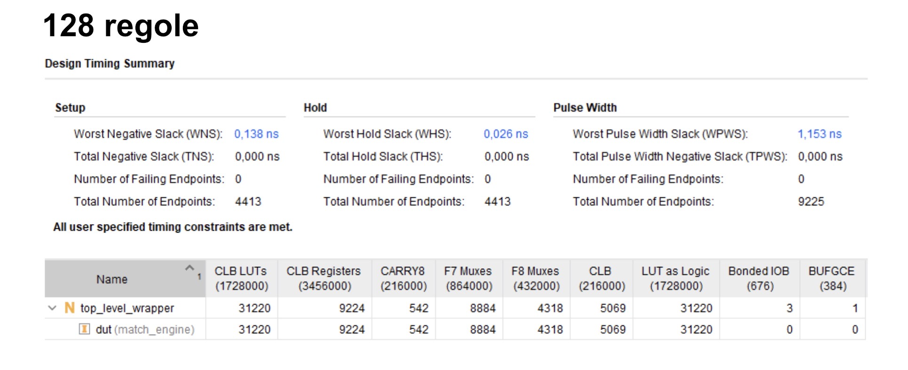
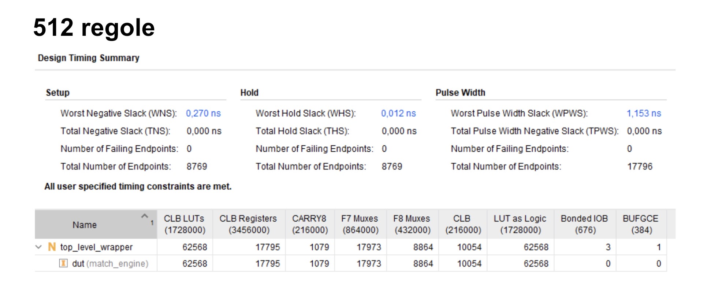
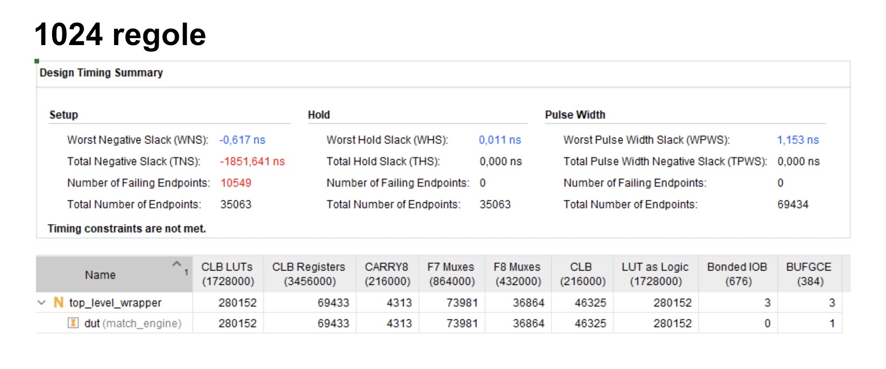

# SmartNIC Traffic Manager on FPGA

This repository contains the **SystemVerilog** implementation of a **Traffic Manager (Match Engine)** module, designed to be integrated into a **SmartNIC** architecture based on the **Xilinx Alveo U250** FPGA.

This project heavily emphasizes the use of the **AMBA AXI protocol**, a core topic studied during the embedded systems course. The module relies extensively on AXI standards to ensure high-throughput data streaming and standardized memory-mapped configuration.

  

*The diagram illustrates the core advantage of an FPGA-based SmartNIC approach: by processing packets directly in hardware on the datapath, the architecture completely bypasses the software network stack bottlenecks, achieving deterministic ultra-low latency.*

## 📌 Architectural Overview

The component is inserted into the network card's datapath between the **CMAC** submodule and the **Packet-Transmitter**, acting as a high-performance filter and inspector for incoming Ethernet traffic.

  

  

*   **AXI4-Stream Data Input:** It receives Ethernet packets from the CMAC module (up to 1518 bytes) via the high-bandwidth **AXI4-Stream** protocol, processing frames at **512 bits** per clock cycle.
*   **Match Engine:** It features a dynamic set of parallel comparators executed in a single clock cycle. It checks specific packet fields or bytes based on configurable logical operators (`==`, `>`, `<`, `>=`, `<=`).
*   **AXI4-Lite Configuration:** The rule array is dynamically programmable at runtime by the **Processing Unit** (e.g., a RISC-V soft-core) via an **AXI4-Lite** compatible interface. The rules are currently implemented as a register bank (Flip-Flops) to guarantee zero-latency asynchronous access for the parallel comparators.
*   **Output Trigger:** If the required conditions are violated (positive match), the module immediately triggers the Packet-Transmitter, sending it the address of the pre-configured reaction packet stored in memory.

## ⚙️ Advanced Features

To allow the creation of complex network filters, a sophisticated Boolean logic has been implemented downstream of the parallel comparators:

1.  **AND/OR Logic:** Allows generating hits by combining the results of individual rules using direct AND or OR masks.
2.  **SOP (Sum of Products):** Provides total flexibility through composite expressions, where product terms (logical ANDs of arbitrary rules) are summed (final logical OR). Example: `(R0 AND R1) OR (R2 AND R3) OR (R4)`.

## 📊 Synthesis and Performance Results

The project was synthesized and implemented in the Vivado environment targeting the **Virtex UltraScale+ xcu250-figd2104-2L-e** board. To thoroughly test the robustness of the design, the module was encapsulated in a `top_level_wrapper`, isolating optimization using the `DONT_TOUCH` attribute.

Stringent exploratory analyses were conducted (with a target clock of **350 MHz**, well above the actual required operating frequencies) to evaluate area utilization (LUTs, FFs) and timing closure by varying the number of rules (16, 128, 512, 1024):

### Implementation Results by Number of Rules

**16 Rules:**

  

**128 Rules:**

  

**512 Rules:**

  

**1024 Rules:**

  

*   The design fully meets the constraints at 350 MHz when scaling up to **512 parallel rules**.
*   More extreme configurations (e.g., 1024 single-cycle rules) saturate setup constraints at such high frequencies due to the routing overhead of the complex SOP cloud, but still remain excellent for standard target frequencies.

## 📂 Project Structure

The main source files are located in the `Elaborato_Embedded.srcs/sources_1/new/` folder:

*   `traffic_manager_pkg.sv`: Package containing data types (`rule_entry_t`), enumerators (`compare_symbol_e`), and configurable parameters (e.g., `NUM_RULES`).
*   `match_engine.sv`: The combinational core of the Traffic Manager. It processes the 512-bit AXI-Stream and applies the SOP masks.
*   `rule_memory.sv`: Module for rule storage, exposing write buses for the AXI configuration logic and interfacing purely combinationally with the engine.
*   `top_level_wrapper.sv`: Isolation wrapper used for synthesis tests to prevent logic trimming due to constant inputs.
